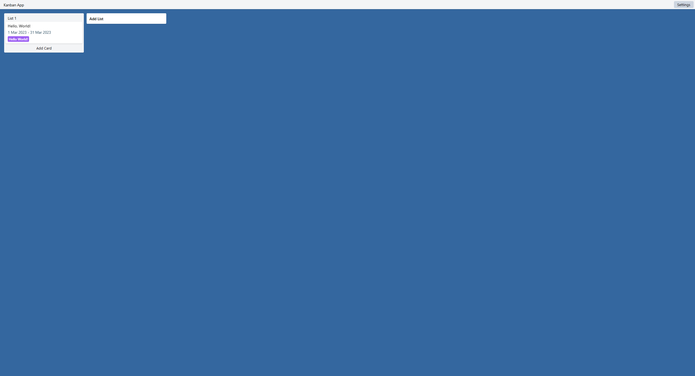

# kanban-app

Standalone react based kanban application.

## frontend

## Notes

- Always ensure that `draggableProps` and `dragHandleProps` go before the 
lock y axis styling. Otherwise the props will override the style props.
